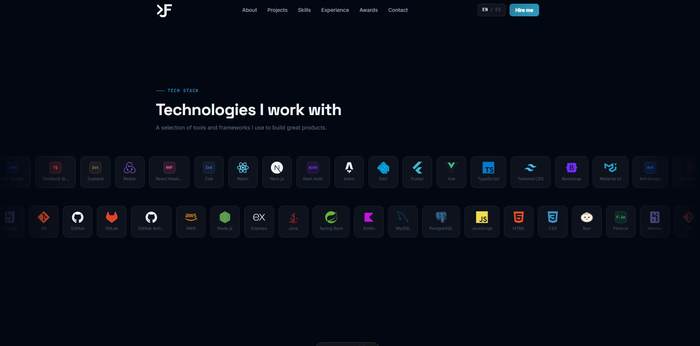

# jose-fuentes-portfolio

Personal developer portfolio showcasing my projects, skills, and experience in building modern web applications

[](https://astro.build)
[](https://www.typescriptlang.org)
[](https://tailwindcss.com)
[](https://vercel.com)

Personal portfolio built with Astro — fast, bilingual, and animated.

---

## Preview



---

## Features

- **Bilingual** (EN / ES) via Astro i18n routing
- **6 sections:** Hero, About, Projects, Skills, Experience, Contact
- **Smooth scroll animations** powered by GSAP and Framer Motion
- **Optimized images** using WebP format and Astro's image pipeline
- **Fully responsive** across all screen sizes
- **Deployed on Vercel** with zero-config CI/CD

---

## Tech Stack

| Category   | Tools                    |
| ---------- | ------------------------ |
| Framework  | Astro 6, React 19        |
| Styling    | Tailwind CSS 4           |
| Animation  | GSAP 3, Framer Motion 12 |
| Language   | TypeScript               |
| Deployment | Vercel                   |

---

## Getting Started

> **Prerequisites:** Node.js `>=22.12.0`

```bash
npm install
npm run dev      # http://localhost:4321
npm run build    # Production build → dist/
npm run preview  # Preview production build
```

---

## Project Structure

```
src/
├── components/
│   ├── layout/     # Navbar, Footer
│   └── sections/   # Hero, About, Projects, Skills, Timeline, Contact
├── content/        # projects.ts — data layer (projects, skills, experience)
├── i18n/           # en.json, es.json + translation utility
├── pages/          # index.astro (en), es/index.astro
└── assets/         # Project screenshots (WebP)
```

---

## Author

Crafted by **José Fuentes** — [GitHub](https://github.com/josegabrielfc) · [LinkedIn](https://www.linkedin.com/in/gabriel-fuentes-1a032b23b)
